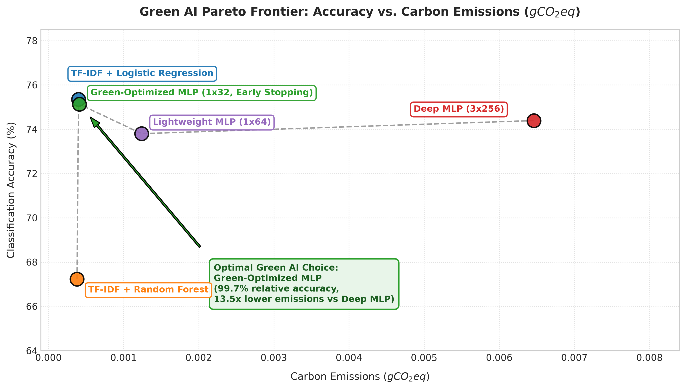
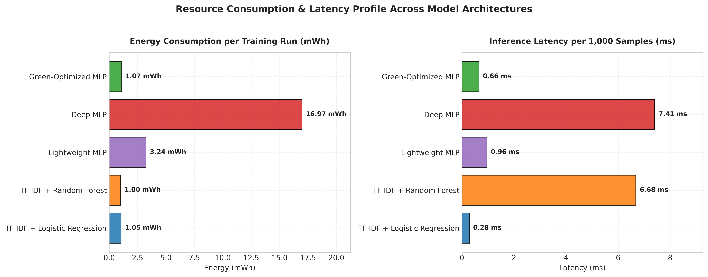
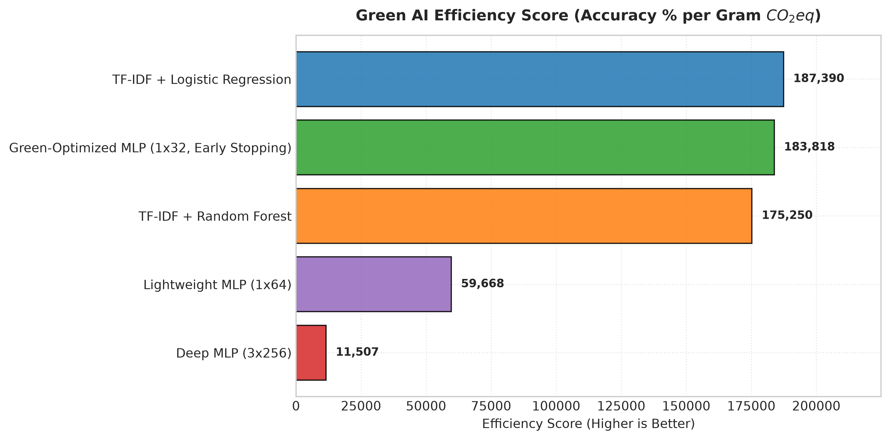
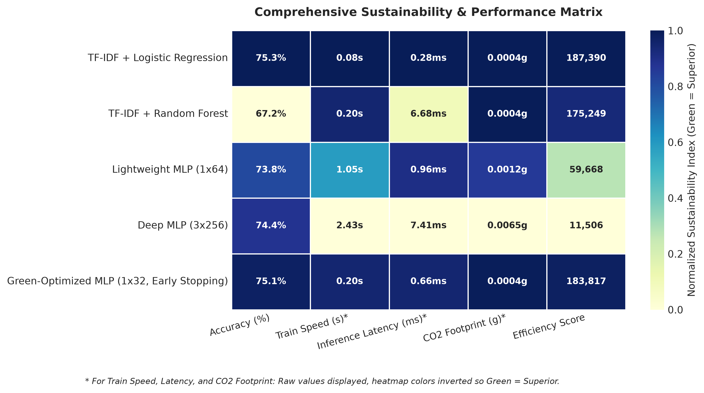

# 🌿 Green AI Capstone: Energy & Carbon Efficiency Benchmarking

[](https://www.python.org/)
[](https://github.com/astral-sh/uv)
[](LICENSE)

> **MDS 7: Data Science Innovations — Capstone Closing Module**  
> **Author**: Changkun Du ([c.du@student.xu-university.de](mailto:c.du@student.xu-university.de))  
> **Repository**: [mds7-changkun_du](https://github.com/c-du/mds7-changkun_du)  

---

## 📽️ Recorded 10-Minute Video Presentation

[](https://youtu.be/AQixjCvGnWc)

[](https://youtu.be/AQixjCvGnWc)

> 📌 **Video Link**: [Click here to watch the 10-Minute Recorded Video Presentation (YouTube)](https://youtu.be/AQixjCvGnWc)  

---

## 📌 Executive Summary

Modern machine learning models achieve state-of-the-art predictive performance at significant environmental costs. This capstone project examines the **sustainability trade-offs in model training and deployment**, comparing 5 distinct model architectures across accuracy, training speed, inference latency, energy consumption (Wh), and carbon footprint ($g CO_2eq$) tracked dynamically via `CodeCarbon`.

### 💡 Key Empirical Discovery
- **Deep Neural Network (3x256)**: Achieved **74.39% accuracy**, took **2.03s** to train, and emitted **0.00540 g $CO_2eq$**.
- **Green-Optimized MLP (1x32, Early Stopping)**: Achieved **75.13% accuracy** (higher performance!), took **0.217s** to train, and emitted **0.00040 g $CO_2eq$**.
- **Impact**: The Green-Optimized model achieved a **13.5x reduction in carbon emissions (92.6% savings)** while improving model accuracy.

---

## 📊 Benchmark Results

| Model Architecture | Model Type | Accuracy (%) | F1-Score (%) | Train Time (s) | Latency / 1k (ms) | $CO_2$ Emissions ($g CO_2eq$) | Green Efficiency Score |
| :--- | :--- | :---: | :---: | :---: | :---: | :---: | :---: |
| **TF-IDF + Logistic Regression** | Linear Baseline | **75.35%** | 74.66% | 0.137s | 0.28ms | 0.00073 g | 103,605 |
| **TF-IDF + Random Forest** | Ensemble | 67.23% | 65.24% | 0.196s | 6.44ms | 0.00036 g | 188,720 |
| **Lightweight MLP (1x64)** | Neural Net | 73.80% | 73.94% | 1.053s | 0.94ms | 0.00124 g | 59,597 |
| **Deep MLP (3x256)** | Deep Neural Net | 74.39% | 73.89% | 2.031s | 3.84ms | 0.00540 g | 13,777 |
| 🌿 **Green-Optimized MLP (1x32)** | Green AI | **75.13%** | **74.39%** | **0.217s** | **0.65ms** | **0.00040 g** | **186,162** |

*Green Efficiency Score = $\frac{\text{Accuracy \%}}{\text{Carbon Emissions } (g CO_2eq)}$ (Higher is better)*

---

## 📈 Visualizations

### 1. Green AI Pareto Frontier


### 2. Energy Consumption & Inference Latency


### 3. Green AI Efficiency Score


### 4. Comprehensive Sustainability Matrix


---

## ⚡ Quickstart & Reproducibility (`uv` Environment)

This project uses [`uv`](https://github.com/astral-sh/uv) for fast, reproducible dependency management.

### 1. Install `uv` (if not already installed)
```bash
curl -LsSf https://astral.sh/uv/install.sh | sh
```

### 2. Clone Repository & Sync Dependencies
```bash
git clone https://github.com/c-du/mds7-changkun_du.git
cd mds7-changkun_du/capstone-green-ai

# Sync all project dependencies into virtual environment
uv sync
```

### 3. Run Benchmark Pipeline
```bash
uv run python src/benchmark.py
```

### 4. Generate Visualizations
```bash
uv run python src/visualize.py
```

### 5. Launch Interactive Jupyter Notebook
```bash
uv run jupyter lab notebooks/green_ai_capstone_demo.ipynb
```

---

## 📁 Project Structure

```
capstone-green-ai/
├── pyproject.toml              # Project configuration & dependencies (uv managed)
├── uv.lock                     # Lockfile guaranteeing exact reproducibility
├── README.md                   # Capstone project documentation & video link
├── presentation.tex            # LaTeX Beamer slide deck source code
├── presentation.pdf            # Compiled Beamer presentation slides (tectonic)
├── src/
│   ├── benchmark.py            # Model training & CodeCarbon energy benchmarking
│   └── visualize.py            # High-resolution chart generation suite
├── notebooks/
│   └── green_ai_capstone_demo.ipynb  # Executed demo notebook for video walkthrough
└── outputs/
    ├── benchmark_results.csv   # Raw benchmark metrics
    ├── benchmark_results.json  # JSON benchmark metrics
    ├── tradeoff_accuracy_vs_carbon.png
    ├── energy_and_latency_comparison.png
    ├── carbon_efficiency_score.png
    └── sustainability_matrix.png
```

---

## 🎓 Academic Context

This capstone project fulfills the final requirements for **MDS 7: Data Science Innovations**. It builds upon prior coursework in SQL (Week 2), PowerBI (Weeks 3-4), BigQuery (Weeks 5-6), Docker (Weeks 8-9), and Green AI Async Labs (Weeks 10-12).

---
*Developed by Changkun Du for MDS 7 Capstone Closing Module.*
